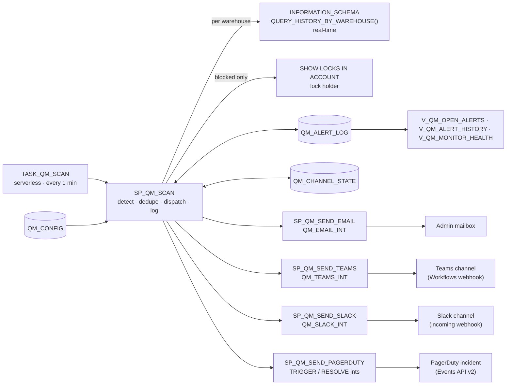
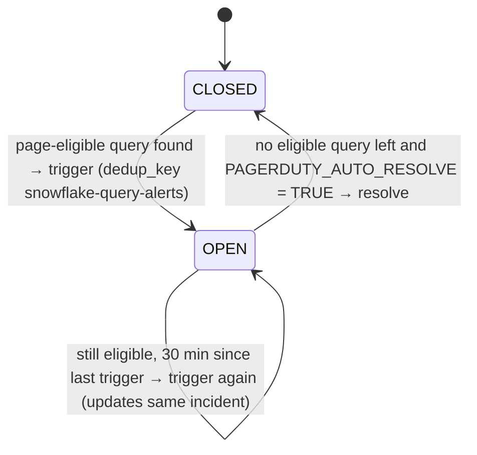

# Design: Snowflake Real-Time Query Alerts

| | |
|---|---|
| Version | 2.0, 2026-10-02 (adds Slack and PagerDuty; channels split into separate modules) |
| Location | Database `OBSERVABILITY`, schema `QUERY_ALERTS` |
| Owner role | `OPS_QUERY_MONITOR` |

## 1. Purpose

Notify the Snowflake Admin team in near real time (about 1 minute) when queries hit any of these conditions:

| Alert | Condition (default, configurable) | Snowflake `EXECUTION_STATUS` |
|---|---|---|
| **LONG_RUNNING** | Executing for ≥ **15 min**. Time spent queued or lock-waiting doesn't count. | `RUNNING` |
| **QUEUED** | Waiting for warehouse capacity for ≥ **5 min** | `QUEUED`, `RESUMING_WAREHOUSE` |
| **BLOCKED** | Waiting on a **table lock** for ≥ **5 min** | `BLOCKED` |

The build uses only native Snowflake features: a serverless task, a SQL stored procedure and notification integrations. There is no external scheduler, function or server.

## 2. Architecture

### Modules (one script each)

| Section | Script | Contents |
|---|---|---|
| Foundation | `00_setup_role_database.sql` | Role, `OBSERVABILITY.QUERY_ALERTS`, task privileges, `MONITOR` on warehouses |
| Foundation | `01_config_and_log_tables.sql` | `QM_CONFIG`, `QM_ALERT_LOG`, `QM_CHANNEL_STATE` |
| Channel | `02_channel_email.sql` | `QM_EMAIL_INT`, `SP_QM_SEND_EMAIL` (HTML table) |
| Channel | `03_channel_teams.sql` | Secret, `QM_TEAMS_INT`, `SP_QM_SEND_TEAMS` (Adaptive Card) |
| Channel | `04_channel_slack.sql` | Secret, `QM_SLACK_INT`, `SP_QM_SEND_SLACK` (mrkdwn) |
| Channel | `05_channel_pagerduty.sql` | Routing-key secret, `QM_PAGERDUTY_TRIGGER_INT`, `QM_PAGERDUTY_RESOLVE_INT`, `SP_QM_SEND_PAGERDUTY` |
| Engine | `06_procedure_scan.sql` | `SP_QM_SCAN` |
| Schedule | `07_task_schedule.sql` | `TASK_QM_SCAN` |
| Consumption | `08_views.sql` | Open alerts, history, monitor health |
| Operate | `09_test_and_operate.sql` | `SP_QM_TEST_CHANNELS`, end-to-end test, day-2 SQL |
| Optional | `10_guardrails_optional.sql` | Statement, queue and lock timeouts |
| Remove | `99_teardown.sql` | Drops everything except the `OBSERVABILITY` database |

**Channel contract.** Every channel module has the same three sections:
- (A) secret and integration, run as ACCOUNTADMIN;
- (B) a sender procedure `SP_QM_SEND_<CHANNEL>(subject)` that formats the rows in the session temp table `QM_CANDIDATES` for that channel;
- (C) a line that sets `<CHANNEL>_ENABLED = TRUE`.

The engine calls only enabled channels, and each call is isolated. Adding another webhook channel (Opsgenie, ServiceNow, Google Chat) means copying a channel module and adding one `IF` block in `SP_QM_SCAN`.

## 3. Processing flow (every minute)

1. **Read config** from `QM_CONFIG`: thresholds, exclusions and channel switches.
2. **Collect** in-flight queries (`RUNNING`, `QUEUED`, `RESUMING_WAREHOUSE`, `BLOCKED`) from each warehouse through `QUERY_HISTORY_BY_WAREHOUSE`. Excluded warehouses and users are skipped.
3. **Measure and classify** each query:
   - running queries: elapsed time minus queued, provisioning, repair and lock time, giving executing minutes;
   - others: elapsed wait time.

   Keep only queries over their threshold.
4. **Find the lock holder** for blocked queries with `SHOW LOCKS IN ACCOUNT` (WAITING joined to HOLDING on the same resource). This is best effort; see §6.
5. **Decide who to notify:**
   - `TO_NOTIFY` (e-mail, Teams, Slack): the query × type is new, or still open with its last notice more than `RENOTIFY_MIN` (30) ago.
   - `PD_ELIGIBLE`: the type is in `PAGERDUTY_ALERT_TYPES` and minutes ≥ `PAGERDUTY_MIN_MINUTES` (30).
   - `PD_NOTIFY`: page-eligible and not included in a trigger within `RENOTIFY_MIN`.
6. **Dispatch:**
   - one digest to e-mail, Teams and Slack;
   - a PagerDuty **trigger** when `PD_NOTIFY` rows exist;
   - a PagerDuty **resolve** when the incident is OPEN and no page-eligible query remains.
7. **Log:** upsert `QM_ALERT_LOG`. Set `RESOLVED_AT` for alerts whose query finished, started executing or got its lock.

## 4. Channel behaviour

| Channel | Audience / purpose | Format | Volume control |
|---|---|---|---|
| E-mail | Admin distribution list, audit trail | HTML table: type, minutes, warehouse (size), user, role, query ID, lock holder; action SQL | One digest per run (≤ 25 rows); 30-min re-notify |
| Microsoft Teams | Admin channel, team awareness | Adaptive Card with a markdown list | Same as e-mail |
| Slack | Admin channel, if the client also uses Slack | mrkdwn bullet list | Same as e-mail |
| PagerDuty | **On-call escalation only** | Events API v2, `severity=error`, summary ≤ 1,024 characters (top 5 queries) | Only `LONG_RUNNING` and `BLOCKED` queries at ≥ 30 min. One incident per account (fixed `dedup_key`), auto-resolved when clear. |

### PagerDuty incident lifecycle

Snowflake webhook body templates are static, so trigger and resolve use **two integrations** that share the routing-key secret. The incident state is tracked in `QM_CHANNEL_STATE`. If several Snowflake accounts page the same PagerDuty service, give each account its own `dedup_key` in `05_channel_pagerduty.sql`.

## 5. Security

| Need | Grant |
|---|---|
| See all users' queries in real time | `MONITOR` on every warehouse. Script 00 grants it for existing warehouses; re-run it when a warehouse is added. |
| Run the serverless task | `EXECUTE TASK`, `EXECUTE MANAGED TASK` on account |
| Send notifications | `USAGE` on each notification integration and webhook secret |
| Lock-holder detail | `SHOW LOCKS IN ACCOUNT` requires ACCOUNTADMIN (§6) |

- **Secrets:** webhook tokens (the Teams workflow ID, the Slack `<TEAM_ID>/<WEBHOOK_ID>/<TOKEN>` path and the PagerDuty routing key) are stored as Snowflake **secrets** and never appear in code or logs.
- **SQL text:** query text is excluded from messages by default (`INCLUDE_QUERY_TEXT = FALSE`), because SQL can contain sensitive literals.
- **ACCOUNTADMIN:** needed only for setup (scripts 00 and 02–05, section A).

## 6. Design decisions and limitations

| Topic | Decision |
|---|---|
| Real-time source | `INFORMATION_SCHEMA.QUERY_HISTORY_BY_WAREHOUSE()` includes in-flight queries with no lag. `ACCOUNT_USAGE.QUERY_HISTORY` lags up to ~45 min and can't be used for real-time alerting. |
| Polling | Snowflake has no event for "query exceeded N minutes", so a 1-minute poll is the simplest option. Worst-case delay is about 1 minute. |
| Task, not `CREATE ALERT` | The check loops over warehouses and dispatches to several channels; an alert condition must be a single query. |
| Per-warehouse scan | Each warehouse returns up to 10,000 recent queries, so a busy warehouse can't hide another's long-running query. Queries that run without a warehouse (metadata-only) aren't covered. |
| Lock holder | `SHOW LOCKS IN ACCOUNT` is ACCOUNTADMIN-only. Under the default owner role, blocked queries are still detected and sent, without the holder's ID. The client may choose to let ACCOUNTADMIN own the task. |
| Alert fatigue | Thresholds and re-notify interval are configurable; batch warehouses and service users can be excluded; PagerDuty receives only escalations. |
| No "cleared" chat message | Kept quiet on purpose. Resolution shows in `V_QM_OPEN_ALERTS`; PagerDuty auto-resolves. |
| Cost | One serverless XSMALL run per minute, typically a few seconds of compute. Use `SCHEDULE = '2 MINUTE'` to halve it. |

## 7. Configuration reference (`QM_CONFIG`)

| Parameter | Default | Meaning |
|---|---|---|
| `LONG_RUNNING_MIN` / `QUEUED_MIN` / `BLOCKED_MIN` | 15 / 5 / 5 | Detection thresholds in minutes |
| `RENOTIFY_MIN` | 30 | Repeat interval for a query that stays open (all channels) |
| `EXCLUDED_WAREHOUSES` / `EXCLUDED_USERS` | empty | Comma lists to ignore |
| `INCLUDE_QUERY_TEXT` | FALSE | Add the first 150 characters of SQL to messages |
| `LOCK_DETAILS` | TRUE | Try to identify the lock holder |
| `MAX_ROWS_IN_MESSAGE` | 25 | Digest cap |
| `EMAIL_ENABLED`, `EMAIL_INTEGRATION`, `EMAIL_RECIPIENTS` | set by 02 | E-mail channel |
| `TEAMS_ENABLED`, `TEAMS_INTEGRATION` | set by 03 | Teams channel |
| `SLACK_ENABLED`, `SLACK_INTEGRATION` | set by 04 | Slack channel |
| `PAGERDUTY_ENABLED`, `PAGERDUTY_TRIGGER_INTEGRATION`, `PAGERDUTY_RESOLVE_INTEGRATION` | set by 05 | PagerDuty channel |
| `PAGERDUTY_ALERT_TYPES` | LONG_RUNNING,BLOCKED | Types that page |
| `PAGERDUTY_MIN_MINUTES` | 30 | Escalation threshold |
| `PAGERDUTY_AUTO_RESOLVE` | TRUE | Resolve the incident when clear |

Changes take effect on the next run with no redeploy.
